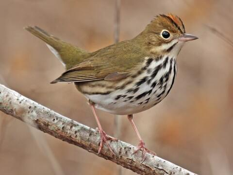

--- 
runtime: shiny

---

<left>

# Species Information: 

### Ovenbird (*Seiurus aurocapilla*) 

  

:::: {style = "display: flex; gap: 10px;"} 

::: {style="flex: 47.5%;"}

{width=100%}

::: 

::: {style="flex: 5%;"} 

::: 

::: {style="flex: 47.5%;"}

## **CONSERVATION STATUS**

* <abbr title="Committee on the Status of Endangered Wildlife in Canada">COSEWIC</abbr> Status: None

* <abbr title="Alberta's Endangered Species Conservation Committee">ESCC</abbr> Status in  Alberta: Special Concern 

* <abbr title="Government of Alberta's general status of wildlife species">General</abbr> Status in  Alberta: Secure 

* <abbr title="Alberta Conservation Information Management System">ACIMS</abbr> Status in  Alberta: [<u>S5B</u>](https://www.alberta.ca/acims-conservation-status-ranks#jumplinks-1) 

* [<u>Link to **ABMI Status** Page</u>](https://abmi.ca/species/ovenbird)

::: 

:::: 

 

## Overview

The Ovenbird (OVEN) is a forest songbird species 

  

blah, blah, blah 

